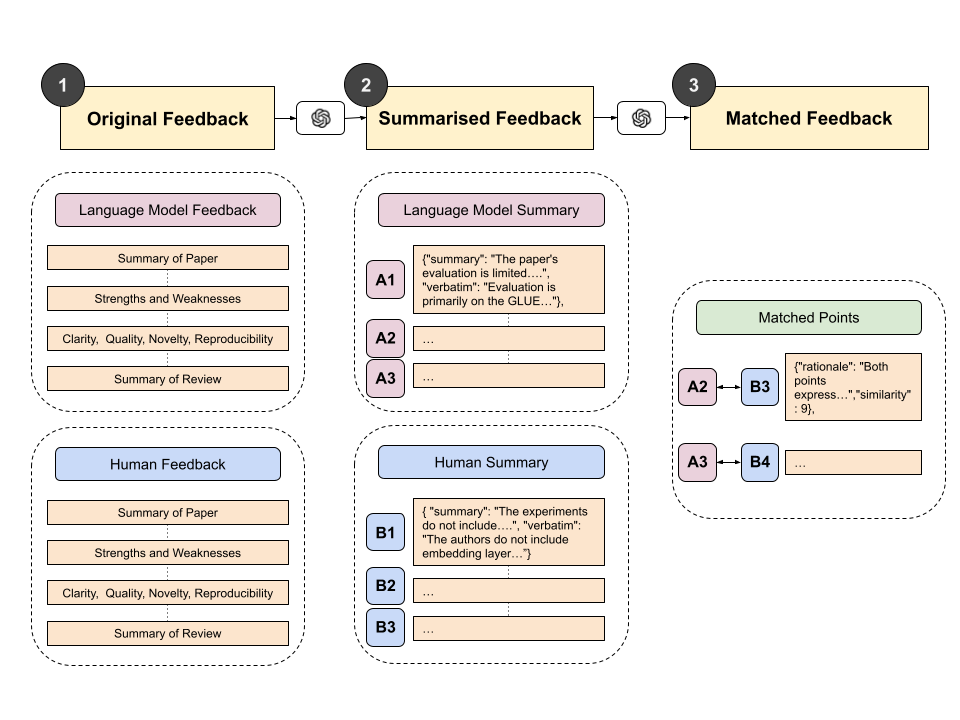
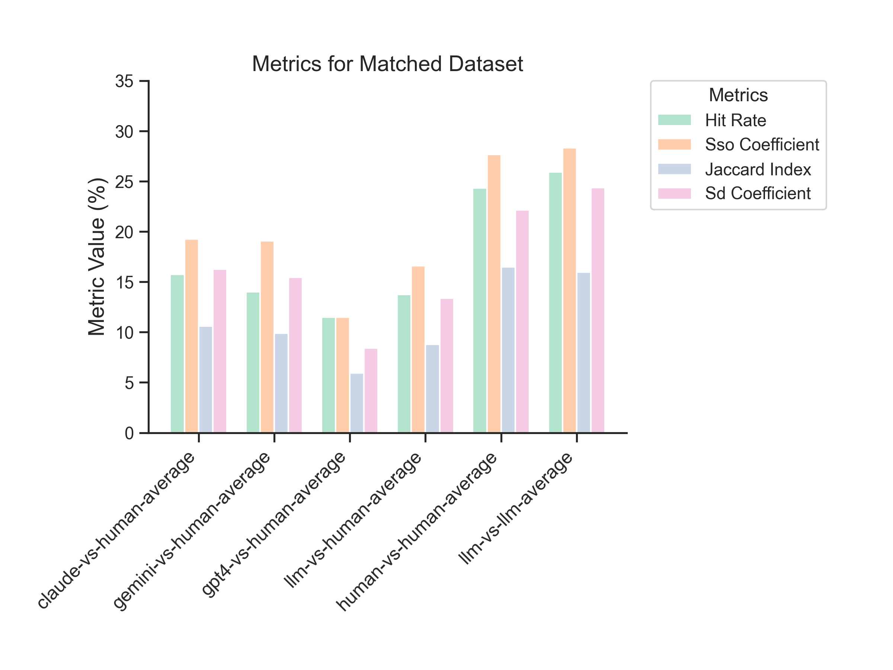
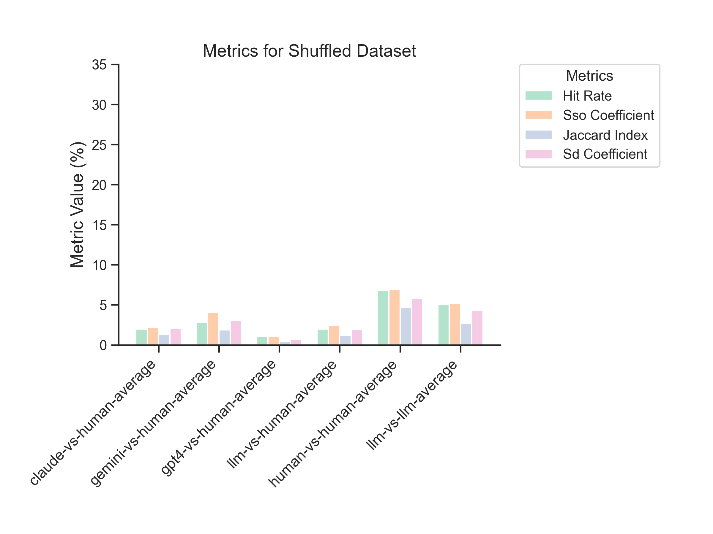

# Peer Review Analysis with LLM-Generated Feedback

This study investigates the potential role of Large Language Models (LLMs) in supporting the peer review process, using both human and LLM-generated reviews to assess consistency and overlap in feedback quality.

## Project Overview

Peer review is crucial for maintaining publication quality standards, yet the increasing volume of research articles challenges traditional review systems. This project explores the feasibility of using LLM-generated reviews as a supportive tool to ease reviewer workload without compromising scientific rigor. Using the ReviewCritique dataset by Du et al., which contains human and LLM reviews for both accepted and rejected papers, we analyze the overlap and consistency between reviews provided by humans and LLMs.



This study evaluates review similarities across multiple LLMs—ChatGPT-4o, Claude Opus, and Gemini Pro. Key findings indicate that LLM-generated reviews maintain consistency across LLMs but differ from human feedback, suggesting a potential supplementary role for LLMs in peer review.





## Repository Structure

The repository is organized as follows:

- **data/**: Contains the original ReviewCritique dataset, including human and LLM reviews for 20 research papers (accepted and rejected).
  
- **extracted/**: Holds extracted and formatted data subsets specifically prepared for this research.

- **processed/**: Stores evaluated metrics in JSON format, generated by `analysis.py` and used as input for `plotting.py`.

- **figures/**: Contains visualization outputs produced by `plotting.py`, based on processed data metrics.

- **prompts/**: Contains prompts from Liang et al., used for generating LLM reviews, comparing reviews, and summarizing key findings.

- **analysis.py**: Script to evaluate overlap metrics between human and LLM reviews. Outputs metrics in JSON format to be used in subsequent plotting.

- **plotting.py**: Script to generate figures based on JSON metrics from `processed/`. Visualizes differences in overlap and consistency across review types.

- **requirements.txt**: Specifies required packages for running the code. Use this file to install dependencies with `pip`.

## Installation

1. Clone the repository:

   ```bash
   git clone https://github.com/dhunstack/llms-for-paper-review.git
   cd llms-for-paper-review
   ```

2. Install the required packages:

   ```bash
   pip install -r requirements.txt
   ```

## Usage

1. **Data Extraction**: Follow the comments and code in the `notebooks` to extract the relevant information of the subset of the dataset to the `extracted/` folder.

1. **Data Analysis**: Run `analysis.py` to process review overlaps and output the metrics into JSON format within the `processed/` folder.

   ```bash
   python analysis.py
   ```

2. **Visualization**: Run `plotting.py` to generate figures from the processed data, saved in the `figures/` folder.

   ```bash
   python plotting.py
   ```

This project is licensed under the [MIT License](https://opensource.org/license/mit).

## Contributing

Contributions are welcome! Feel free to open an issue for suggestions or bug reports, or submit pull requests for improvements.
